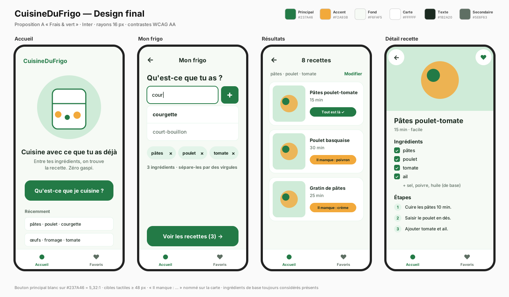

# m291-albion

Albion, médiamaticien 3ème année · SM-C2b · Module ICT 291

## Ce que je veux apprendre

- à faire un site interactif

## Mon app : CuisineDuFrigo

Une app mobile qui propose des recettes à partir des ingrédients qu'on a déjà chez soi, pour éviter le gaspillage.

## Livrables

| Étape | Fichier |
| --- | --- |
| Pitch | [`mon_app/Design/pitch.md`](mon_app/Design/pitch.md) |
| Persona | [`mon_app/Design/persona.md`](mon_app/Design/persona.md) |
| User flow | [`mon_app/Design/user-flow.md`](mon_app/Design/user-flow.md) |
| Brief (spécification) | [`brief.md`](brief.md) |
| Wireframe | [`mon_app/Design/wireframes/`](mon_app/Design/wireframes/) |
| Propositions de design (IA) | [`mon_app/Design/propositions/`](mon_app/Design/propositions/) |
| Critique et choix final | [`mon_app/Design/critique.md`](mon_app/Design/critique.md) |
| Design final | [`mon_app/Design/design-final.png`](mon_app/Design/design-final.png) |
| Tests utilisateurs et audit d'accessibilité | [`mon_app/Design/tests-utilisateurs.md`](mon_app/Design/tests-utilisateurs.md) |
| Fiche d'observation e2-7 | [`mon_app/Design/fiche-observation.md`](mon_app/Design/fiche-observation.md) |

## Autres fichiers

- [`kit-ia.md`](kit-ia.md) — mon kit d'outils IA
- [`grille-roast-e2-1.md`](grille-roast-e2-1.md) — grille de l'exercice roast
