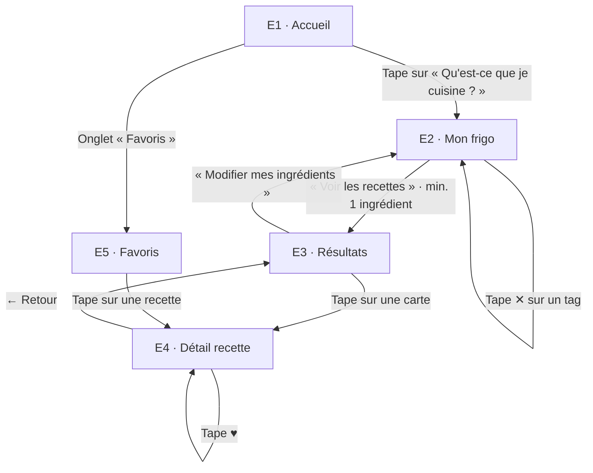

# User Flow — CuisineDuFrigo

**Persona :** Kevin, 18 ans (voir `persona.md`)
**Tâche n°1 :** entrer une liste d'ingrédients et voir les recettes possibles

## Schéma

## Étapes détaillées

| # | Écran | Action de Kevin | Ce que l'app fait / affiche | Feedback attendu |
| --- | --- | --- | --- | --- |
| 1 | **E1 Accueil** | Ouvre l'app | Logo, titre « Cuisine avec ce que tu as déjà », gros bouton « Qu'est-ce que je cuisine ? », barre d'onglets (Accueil / Favoris) | Un seul appel à l'action visible, chargement < 1 s |
| 2 | **E1 Accueil** | Tape sur le bouton principal | Navigation vers E2 | Transition fluide |
| 3 | **E2 Mon frigo** | Tape « pâtes » dans le champ | Liste de suggestions sous le champ (pâtes, pâte feuilletée…), lignes de 48 px | Suggestions dès 2 lettres |
| 4 | **E2 Mon frigo** | Valide (bouton « + », Entrée ou suggestion) | Ajoute un tag « pâtes ✕ », vide le champ | Tag apparaît avec petite animation, compteur « 1 ingrédient » |
| 5 | **E2 Mon frigo** | Tape « poulet, tomate » d'un coup | Le texte est découpé sur les virgules : 2 tags ajoutés | Bouton « Voir les recettes (3) » devient actif (couleur pleine) |
| 6 | **E2 Mon frigo** | Tape ✕ sur un tag | Supprime l'ingrédient | Tag disparaît, compteur mis à jour |
| 7 | **E2 Mon frigo** | Tape « Voir les recettes » | Filtre les fiches recettes, navigation vers E3 | Indicateur de chargement si > 300 ms |
| 8 | **E3 Résultats** | Parcourt la liste | Cartes triées par % d'ingrédients possédés : nom, temps, badge « Tout est là ✓ » ou « Il manque : ail » (ingrédient nommé) | Rappel des ingrédients saisis en haut |
| 9 | **E3 Résultats** | Tape sur une carte | Navigation vers E4 | — |
| 10 | **E4 Détail** | Lit la recette | Ingrédients (possédés = coché vert, manquants = « à acheter » en orange, ingrédients de base listés à part), temps, étapes numérotées | Distinction visuelle immédiate possédé / manquant |
| 11 | **E4 Détail** | Tape ♥ | Ajoute aux favoris | Cœur se remplit + toast « Ajoutée aux favoris » |
| 12 | **E5 Favoris** | Ouvre l'onglet | Liste des recettes enregistrées | Recette ajoutée visible en premier |

## Cas limites (version courte)

| Situation | Réponse de l'app |
| --- | --- |
| Aucun ingrédient saisi | Bouton « Voir les recettes » désactivé + texte d'aide « Ajoute au moins 1 ingrédient » |
| Ingrédient inconnu | Ajouté quand même en tag, message discret « Pas reconnu, on cherche quand même » |
| Ingrédient de base (sel, huile…) | Jamais compté comme manquant |
| Ingrédient en double | Pas de second tag, le tag existant clignote |
| Aucune recette trouvée | Écran vide illustré : « Aucune recette avec ça… essaie d'enlever un ingrédient » + bouton retour |
| Aucun favori | Message « Tape ♥ sur une recette pour la retrouver ici » |
